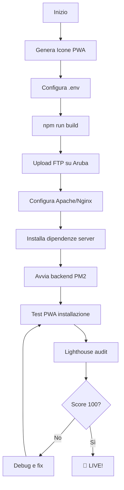

# 📱 MedAxis² - Progressive Web App (PWA)
## Guida Completa per Deployment su Aruba Cloud

---

## 🎯 Obiettivo

Trasformare MedAxis² in una **Progressive Web App (PWA)** installabile su:
- 📱 **Android** (Chrome, Samsung Internet)
- 🍎 **iOS** (Safari)
- 💻 **Windows** (Chrome, Edge)
- 🖥️ **macOS** (Safari, Chrome)

**URL Produzione**: `https://www.neurohrv.it/medaxis2/`

---

## 📚 Documentazione Disponibile

Questo progetto include 3 guide complete:

### 1. **BUILD_INSTRUCTIONS.md** 📦
**Quando usarla**: Prima di deployare su Aruba

Copre:
- ✅ Generazione icone PWA (5 dimensioni necessarie)
- ✅ Configurazione variabili d'ambiente
- ✅ Build di produzione (frontend + backend)
- ✅ Verifica output build
- ✅ Test build locale
- ✅ Troubleshooting build

**Leggi prima**: [BUILD_INSTRUCTIONS.md](./BUILD_INSTRUCTIONS.md)

---

### 2. **DEPLOYMENT_ARUBA.md** 🚀
**Quando usarla**: Dopo aver creato il build, per caricare su server Aruba

Copre:
- ✅ Configurazione server (Apache/Nginx)
- ✅ Upload file via FTP/SFTP
- ✅ Installazione dipendenze produzione
- ✅ Avvio backend (PM2 o systemd)
- ✅ Test installazione PWA su tutti i dispositivi
- ✅ Troubleshooting deployment
- ✅ Monitoraggio e sicurezza

**Leggi dopo BUILD**: [DEPLOYMENT_ARUBA.md](./DEPLOYMENT_ARUBA.md)

---

### 3. **PWA_DEPLOYMENT_README.md** (Questo file) 📖
**Quando usarla**: Come riferimento generale e roadmap

Fornisce:
- ✅ Overview progetto PWA
- ✅ Workflow completo deployment
- ✅ Quick start guide
- ✅ Feature PWA implementate
- ✅ Link a documentazione dettagliata

---

## ⚡ Quick Start (3 Step)

### STEP 1: Build Locale
```bash
# 1. Genera icone PWA
./scripts/generate-pwa-icons.sh

# 2. Configura .env produzione
cp .env.example .env
# Edita .env con credenziali reali

# 3. Build
npm install
npm run build

# Verifica
ls -la dist/public/
```

**Dettagli completi**: Leggi [BUILD_INSTRUCTIONS.md](./BUILD_INSTRUCTIONS.md)

---

### STEP 2: Upload su Aruba
```bash
# Via SFTP/rsync
rsync -avz dist/public/ user@neurohrv.it:/var/www/neurohrv.it/medaxis2/public/
rsync -avz dist/server/ user@neurohrv.it:/var/www/neurohrv.it/medaxis2/server/
rsync -avz package.json .env user@neurohrv.it:/var/www/neurohrv.it/medaxis2/

# SSH al server
ssh user@neurohrv.it
cd /var/www/neurohrv.it/medaxis2

# Installa dipendenze produzione
npm install --production

# Avvia backend
pm2 start server/index.js --name medaxis2
```

**Dettagli completi**: Leggi [DEPLOYMENT_ARUBA.md](./DEPLOYMENT_ARUBA.md)

---

### STEP 3: Verifica PWA
1. Apri `https://www.neurohrv.it/medaxis2/`
2. **Android**: Chrome → Menu → "Installa app"
3. **iOS**: Safari → Condividi → "Aggiungi a Home"
4. **Windows/Mac**: Chrome → Barra indirizzi → Icona "+"
5. **Test Lighthouse**: DevTools → Lighthouse → PWA audit → Target: 100/100

**Dettagli completi**: Leggi [DEPLOYMENT_ARUBA.md → STEP 6](./DEPLOYMENT_ARUBA.md#-step-6-verifica-deployment)

---

## ✨ Feature PWA Implementate

### 🎨 Manifest (`manifest.webmanifest`)
- **Nome**: "MedAxis² - Medical Pain Assessment"
- **Nome breve**: "MedAxis²"
- **Tema**: Blu professionale (#0284c7)
- **Display**: Standalone (come app nativa)
- **Icone**: 5 dimensioni (64, 192, 512px + Apple + Maskable)
- **Shortcuts**: Link rapido a Dashboard
- **Screenshots**: Mobile + Desktop

**File**: `client/public/manifest.webmanifest`

---

### 🔧 Service Worker (`sw.js`)
- **Cache Strategy**: Network First per API, Cache First per asset
- **Offline Support**: Fallback a cache quando offline
- **Auto-update**: Rilevamento nuove versioni
- **Performance**: Precaching asset essenziali

**File**: `client/public/sw.js`

---

### 📱 Icone Multi-Dispositivo

| Dispositivo | Dimensione | File | Scopo |
|-------------|------------|------|-------|
| PWA Base | 64x64 | `pwa-64x64.png` | Favicon HD |
| Android/Windows | 192x192 | `pwa-192x192.png` | Icon standard |
| Android/Windows | 512x512 | `pwa-512x512.png` | Icon HD |
| iOS | 180x180 | `apple-touch-icon-180x180.png` | Home screen |
| Adaptive | 512x512 | `maskable-icon-512x512.png` | Android adaptive |

**Generazione**: Usa `scripts/generate-pwa-icons.sh` o tool online

---

### 🌐 Meta Tags Ottimizzati

```html
<!-- PWA Core -->
<link rel="manifest" href="/manifest.webmanifest" />
<meta name="theme-color" content="#0284c7" />

<!-- iOS Specific -->
<meta name="apple-mobile-web-app-capable" content="yes" />
<meta name="apple-mobile-web-app-status-bar-style" content="default" />
<meta name="apple-mobile-web-app-title" content="MedAxis²" />

<!-- Icons -->
<link rel="apple-touch-icon" sizes="180x180" href="/apple-touch-icon-180x180.png" />
<link rel="icon" type="image/png" sizes="192x192" href="/pwa-192x192.png" />
<link rel="icon" type="image/png" sizes="512x512" href="/pwa-512x512.png" />
```

**File**: `client/index.html`

---

### 🔄 Registrazione Service Worker

Registrazione automatica con:
- ✅ Auto-update detection
- ✅ Controller change handling
- ✅ Update notification prompt
- ✅ Install prompt management

**File**: `client/src/registerSW.ts`
**Attivazione**: `client/src/main.tsx`

---

## 🏗️ Architettura Build

```
MedAxis² (Source)
│
├── npm run build
│   │
│   ├── Frontend (Vite)
│   │   └── dist/public/
│   │       ├── index.html
│   │       ├── manifest.webmanifest
│   │       ├── sw.js
│   │       ├── assets/
│   │       │   ├── index-[hash].js (minified)
│   │       │   └── index-[hash].css (minified)
│   │       └── *.png (icone PWA)
│   │
│   └── Backend (TypeScript → JavaScript)
│       └── dist/server/
│           ├── index.js
│           ├── routes.js
│           ├── storage.js
│           └── ...
│
└── Aruba Cloud Deployment
    └── /var/www/neurohrv.it/medaxis2/
        ├── public/ (← dist/public/)
        ├── server/ (← dist/server/)
        ├── node_modules/ (npm install --production)
        ├── package.json
        └── .env (credenziali produzione)
```

---

## 🔒 Requisiti Tecnici PWA

### Obbligatori

- ✅ **HTTPS**: Certificato SSL valido (Let's Encrypt OK)
- ✅ **Manifest**: `manifest.webmanifest` con nome, icone, colors
- ✅ **Service Worker**: `sw.js` registrato e attivo
- ✅ **Icons**: Minimo 192x192 e 512x512 PNG
- ✅ **Start URL**: Deve essere accessibile e funzionante
- ✅ **Display Mode**: `standalone` o `fullscreen`

### Raccomandati

- ✅ **Apple Touch Icon**: 180x180 per iOS
- ✅ **Maskable Icon**: Adaptive icon per Android 8+
- ✅ **Theme Color**: Match con design app
- ✅ **Background Color**: Per splash screen
- ✅ **Shortcuts**: Link rapidi (es: Dashboard)
- ✅ **Screenshots**: Mobile + Desktop per app stores

---

## 📊 Performance Target

### Lighthouse Scores

Obiettivi per build produzione:

| Categoria | Target | Criticità |
|-----------|--------|-----------|
| **PWA** | 100/100 | 🔴 CRITICO |
| Performance | 90+ | 🟡 Importante |
| Accessibility | 95+ | 🟡 Importante |
| Best Practices | 95+ | 🟢 Raccomandato |
| SEO | 100 | 🟢 Raccomandato |

**Test**: Chrome DevTools → Lighthouse → Run Audit

### Bundle Size Target

- Frontend (gzipped): **< 500 KB**
- CSS (gzipped): **< 100 KB**
- Immagini totali: **< 500 KB**
- First Contentful Paint: **< 1.5s**
- Time to Interactive: **< 3.0s**

---

## 🔧 Troubleshooting Rapido

### ❌ PWA non installabile

**Check**:
1. HTTPS attivo? → `https://` non `http://`
2. Manifest accessibile? → Apri `/manifest.webmanifest`
3. Service Worker registrato? → DevTools → Application → Service Workers
4. Icone presenti? → Verifica `/pwa-192x192.png` carica
5. Lighthouse PWA = 100? → Run audit

**Fix**: Vedi [DEPLOYMENT_ARUBA.md → Troubleshooting](./DEPLOYMENT_ARUBA.md#-troubleshooting)

---

### ❌ Service Worker non si registra

**Check**:
1. Console browser ha errori?
2. Path `/sw.js` accessibile?
3. HTTPS attivo? (obbligatorio!)
4. Cache browser pulita?

**Fix**:
```javascript
// DevTools → Console
navigator.serviceWorker.getRegistrations().then(regs => {
  regs.forEach(reg => reg.unregister())
})
location.reload()
```

---

### ❌ Icone non appaiono

**Check**:
1. File fisici esistono in `public/`?
2. Dimensioni corrette (192x192, 512x512)?
3. Format PNG (non JPG/WebP)?
4. Path nel manifest corretti?

**Fix**: Rigenera icone con script o tool online

---

## 🚀 Workflow Deployment Completo

### Prima Volta (Full Setup)



### Aggiornamenti (Update Deploy)

```bash
# 1. Build locale
npm run build

# 2. Upload solo modifiche
rsync -avz --delete dist/public/ user@neurohrv.it:/var/www/.../public/
rsync -avz dist/server/ user@neurohrv.it:/var/www/.../server/

# 3. Riavvia backend
ssh user@neurohrv.it
pm2 restart medaxis2

# 4. Incrementa cache version in sw.js (se necessario)
# const CACHE_NAME = 'medaxis2-v1.0.1'; // ← Incrementa
```

---

## 📱 Test Installation Guide

### Android (Chrome)
1. Apri `https://www.neurohrv.it/medaxis2/` in Chrome
2. Menu (3 puntini) → "Installa app" / "Add to Home screen"
3. Conferma installazione
4. App appare nel drawer applicazioni
5. Si apre in finestra standalone (senza barra browser)

### iOS (Safari)
1. Apri `https://www.neurohrv.it/medaxis2/` in Safari
2. Tap icona **Condividi** (quadrato con freccia ↑)
3. Scroll e tap "**Aggiungi a Home**"
4. Personalizza nome se desiderato
5. Tap "Aggiungi"
6. Icona app appare nella Home Screen

### Windows (Chrome/Edge)
1. Apri `https://www.neurohrv.it/medaxis2/`
2. Guarda barra indirizzi → Icona **"+"** o **computer**
3. Click "Installa MedAxis²"
4. App si apre in finestra dedicata
5. Pin a taskbar/start menu

### macOS (Chrome/Safari)
**Chrome**:
1. Apri `https://www.neurohrv.it/medaxis2/`
2. Barra indirizzi → Icona **"+"**
3. Click "Install"

**Safari**:
1. File → Add to Dock
2. O usa Chrome method sopra

---

## 🎯 Checklist Pre-Launch

Prima di annunciare il lancio pubblico:

### Tecnico
- [ ] HTTPS certificato valido e auto-renewing
- [ ] Tutte icone PWA generate e caricate
- [ ] Manifest accessibile e validato
- [ ] Service Worker registrato senza errori
- [ ] Lighthouse PWA score = 100/100
- [ ] Backend Node.js avviato e stabile (PM2)
- [ ] Database connesso e funzionante
- [ ] Email SMTP testato (invio questionari)
- [ ] PayPal configurato modalità LIVE

### Funzionale
- [ ] Registrazione nuovo operatore funziona
- [ ] Login/logout funziona
- [ ] Invio questionario paziente via email/WhatsApp
- [ ] Compilazione questionario paziente
- [ ] Generazione PDF report criptato
- [ ] Download report funziona
- [ ] Dashboard analytics visualizza dati
- [ ] Upgrade GO → PRO funziona

### Multi-Dispositivo
- [ ] Installazione Android testata
- [ ] Installazione iOS testata
- [ ] Installazione Windows testata
- [ ] Installazione macOS testata
- [ ] Funzionalità offline testata
- [ ] Responsive design OK su tutti i dispositivi

### Monitoring
- [ ] Logs backend configurati
- [ ] Monitoring uptime configurato
- [ ] Backup database automatico attivo
- [ ] Error tracking configurato (Sentry)

---

## 📞 Supporto

### Documentazione
- **Build**: [BUILD_INSTRUCTIONS.md](./BUILD_INSTRUCTIONS.md)
- **Deploy**: [DEPLOYMENT_ARUBA.md](./DEPLOYMENT_ARUBA.md)
- **PWA**: [PWA_DEPLOYMENT_README.md](./PWA_DEPLOYMENT_README.md) (questo file)

### Risorse Esterne
- **PWA Testing**: https://www.pwabuilder.com/
- **Lighthouse**: Chrome DevTools → Lighthouse
- **Icon Generator**: https://realfavicongenerator.net
- **Manifest Validator**: https://manifest-validator.appspot.com/

### Debugging
- **Chrome DevTools**: F12 → Application → Manifest / Service Workers
- **Safari Web Inspector**: Develop → Show Web Inspector
- **Firefox DevTools**: F12 → Application → Manifest

---

## 🎉 Congratulazioni!

Seguendo questa documentazione, MedAxis² sarà una **Progressive Web App** professionale installabile su qualsiasi dispositivo!

**URL Live**: https://www.neurohrv.it/medaxis2/

**Next Steps**:
1. Leggi [BUILD_INSTRUCTIONS.md](./BUILD_INSTRUCTIONS.md)
2. Esegui build locale
3. Segui [DEPLOYMENT_ARUBA.md](./DEPLOYMENT_ARUBA.md)
4. Test installazione multi-dispositivo
5. Launch! 🚀

---

## 📄 License & Copyright

**MedAxis²** - Medical Pain Assessment System
© 2024-2025 [Your Company]. All rights reserved.

Progressive Web App implementation by Replit Agent.
Deployed on Aruba Cloud - www.neurohrv.it/medaxis2/
